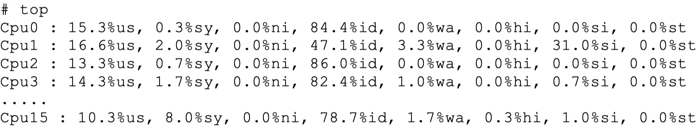

# 外在原因

## CPU竞争

CPU竞争问题如下：

* 进程竞争：Redis是典型的CPU密集型应用，不建议和其他多核CPU密集型服务部署在一起。当其他进程过度消耗CPU时，将严重影响Redis吞吐量。可以通过top、sar等命令定位到CPU消耗的时间点和具体进程，这个问题比较容易发现，需要调整服务之间部署结构。
* 绑定CPU：部署Redis时为了充分利用多核CPU，通常一台机器部署多个实例。常见的一种优化是把Redis进程绑定到CPU上，用于降低CPU频繁上下文切换的开销。这个优化技巧正常情况下没有问题，但是存在例外情况， 如图所示。


当Redis父进程创建子进程进行RDB/AOF重写时，如果做了CPU绑定， 会与父进程共享使用一个CPU。子进程重写时对单核CPU使用率通常在90% 以上，父进程与子进程将产生激烈CPU竞争，极大影响Redis稳定性。因此 对于开启了持久化或参与复制的主节点不建议绑定CPU。

## 内存交换

内存交换（swap）对于Redis来说是非常致命的，Redis保证高性能的一个重要前提是所有的数据在内存中。如果操作系统把Redis使用的部分内存换出到硬盘，由于内存与硬盘读写速度差几个数量级，会导致发生交换后的 Redis性能急剧下降。识别Redis内存交换的检查方法如下：

1）查询Redis进程号：

```text
# redis-cli -p 6383 info server | grep process_id
process_id:4476
```

2）根据进程号查询内存交换信息：

```text
# cat /proc/4476/smaps | grep Swap
Swap: 0 kB
Swap: 0 kB
Swap: 4 kB
Swap: 0 kB
Swap: 0 kB
.....
```

如果交换量都是0KB或者个别的是4KB，则是正常现象，说明Redis进程内存没有被交换。预防内存交换的方法有：

* 保证机器充足的可用内存。
* 确保所有Redis实例设置最大可用内存（maxmemory），防止极端情况下Redis内存不可控的增长。
* 降低系统使用swap优先级，如echo10&gt;/proc/sys/vm/swappiness。

## 网络问题

网络问题经常是引起Redis阻塞的问题点。常见的网络问题主要有：连接拒绝、网络延迟、网卡软中断等。

### 连接拒绝

当出现网络闪断或者连接数溢出时，客户端会出现无法连接Redis的情况。我们需要区分这三种情况：网络闪断、Redis连接拒绝、连接溢出。

**第一种情况：网络闪断。**一般发生在网络割接或者带宽耗尽的情况，对于网络闪断的识别比较困难，常见的做法可以通过sar-n DEV查看本机历史流量是否正常，或者借助外部系统监控工具（如Ganglia）进行识别。具体问题定位需要更上层的运维支持，对于重要的Redis服务需要充分考虑部署架构的优化，尽量避免客户端与Redis之间异地跨机房调用。

**第二种情况：Redis连接拒绝。**Redis通过maxclients参数控制客户端最大连接数，默认10000。当Redis连接数大于maxclients时会拒绝新的连接进入， info stats的rejected\_connections统计指标记录所有被拒绝连接的数量：

```text
# redis-cli -p 6384 info Stats | grep rejected_connections
rejected_connections:0
```

Redis使用多路复用IO模型可支撑大量连接，但是不代表可以无限连接。客户端访问Redis时尽量采用NIO长连接或者连接池的方式。

当Redis用于大量分布式节点访问且生命周期比较短的场景时，如比较典型的在Map/Reduce中使用Redis。因为客户端服务存在频繁启动和销毁的情况且默认Redis不会主动关闭长时间闲置连接或检查关闭无效的TCP连接，因此会导致Redis连接数快速消耗且无法释放的问题。这种场景下建议设置tcp-keepalive和timeout参数让Redis主动检查和关闭无效连接。

**第三种情况：连接溢出。**这是指操作系统或者Redis客户端在连接时的问题。这个问题的原因比较多，下面就分别介绍两种原因：进程限制、 backlog队列溢出。

（1）进程限制

客户端想成功连接上Redis服务需要操作系统和Redis的限制都通过才可以，如图所示。


操作系统一般会对进程使用的资源做限制，其中一项是对进程可打开最大文件数控制，通过ulimit-n查看，通常默认1024。由于Linux系统对TCP连接也定义为一个文件句柄，因此对于支撑大量连接的Redis来说需要增大这个值，如设置ulimit-n65535，防止Too many open files错误。

（2）backlog队列溢出

系统对于特定端口的TCP连接使用backlog队列保存。Redis默认的长度为511，通过tcp-backlog参数设置。如果Redis用于高并发场景为了防止缓慢连接占用，可适当增大这个设置，但必须大于操作系统允许值才能生效。当 Redis启动时如果tcp-backlog设置大于系统允许值将以系统值为准，Redis打印如下警告日志：

```text
# WARNING: The TCP backlog setting of 511 cannot be enforced because /proc/sys/ net/core/somaxconn is set to the lower value of 128.
```

系统的backlog默认值为128，使用echo511&gt;/proc/sys/net/core/somaxconn 命令进行修改。可以通过netstat-s命令获取因backlog队列溢出造成的连接拒 绝统计，如下：

```text
# netstat -s | grep overflowed
663 times the listen queue of a socket overflowed
```

如果怀疑是backlog队列溢出，线上可以使用cron定时执行netstat-s\|grep overflowed统计，查看是否有持续增长的连接拒绝情况。

### 网络延迟

网络延迟取决于客户端到Redis服务器之间的网络环境。主要包括它们之间的物理拓扑和带宽占用情况。常见的物理拓扑按网络延迟由快到慢可分为：同物理机&gt;同机架&gt;跨机架&gt;同机房&gt;同城机房&gt;异地机房。但它们容灾性正好相反，同物理机容灾性最低而异地机房容灾性最高。Redis提供了测量机器之间网络延迟的工具，在redis-cli-h{host}-p{port}命令后面加入如下参数进行延迟测试：

* --latency：持续进行延迟测试，分别统计：最小值、最大值、平均值、 采样次数。
* --latency-history：统计结果同--latency，但默认每15秒完成一行统计， 可通过-i参数控制采样时间。
* --latency-dist：使用统计图的形式展示延迟统计，每1秒采样一次。

网络延迟问题经常出现在跨机房的部署结构上，对于机房之间延迟比较 严重的场景需要调整拓扑结构，如把客户端和Redis部署在同机房或同城机房等。

带宽瓶颈通常出现在以下几个方面：

* 机器网卡带宽。
* 机架交换机带宽。
* 机房之间专线带宽。

带宽占用主要根据当时使用率是否达到瓶颈有关，如频繁操作Redis的 大对象对于千兆网卡的机器很容易达到网卡瓶颈，因此需要重点监控机器流量，及时发现网卡打满产生的网络延迟或通信中断等情况，而机房专线和交换机带宽一般由上层运维监控支持，通常出现瓶颈的概率较小。

### 网卡软中断

网卡软中断是指由于单个网卡队列只能使用一个CPU，高并发下网卡数据交互都集中在同一个CPU，导致无法充分利用多核CPU的情况。网卡软中断瓶颈一般出现在网络高流量吞吐的场景，如下使用“top+数字1”命令可以很明显看到CPU1的软中断指标（si）过高：



Linux在内核2.6.35以后支持Receive Packet Steering（RPS），实现了在软件层面模拟硬件的多队列网卡功能。具体配置见Torvalds的GitHub文 档：[https://github.com/torvalds/linux/blob/master/Documentation/networking/scalin](https://github.com/torvalds/linux/blob/master/Documentation/networking/scalin)

